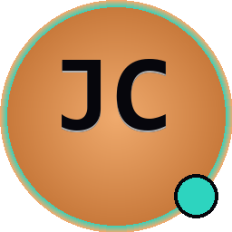
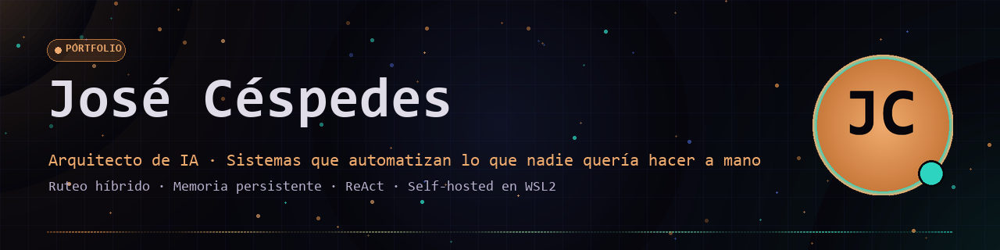

  

# Hola, soy José Céspedes 👋

### Arquitecto de IA · Sistemas que automatizan lo que nadie quería hacer a mano

  
  
  

---

Construyo **sistemas con IA** que resuelven problemas reales, no demos: agentes con memoria persistente, ruteo híbrido entre razonamiento simbólico y modelos pequeños, RPA con visión artificial, y pipelines ETL que ahorran horas de trabajo manual.

Mi tesis: **la IA no es magia, es arquitectura**. Un LLM pequeño (Qwen 0.5B) puede comportarse como un modelo PRO si le das el sistema correcto — memoria, skills, contexto dinámico, y la capacidad de *actuar* sobre el mundo real, no solo responder.

Empecé automatizando mi propio trabajo como Analista de Costos. Cada sistema que construyo parte de un problema real: facturación que tomaba 2 días ahora toma 7 minutos, registro contable que era manual ahora es un bot con OCR, y reportes mensuales que se quebraban por duplicados ahora se deduplican antes de consolidarse.

> 🏔️ *"La mejor automatización es la que nadie nota. Solo ven el resultado."*

---

## 🧠 Lo que diseño y construyo

- **Agentes con memoria tripartita** — episódica, semántica, procedural. Aprenden sin reentrenar.
- **Ruteo híbrido** — motor simbólico (rápido, sin GPU) + SLM local (Qwen/Llama vía Ollama) con fallback automático.
- **Function calling nativo** — sin OpenAI, sin APIs pagas. Skills registradas en código Python.
- **RPA con visión artificial** — Tesseract + pyautogui para automatizar sistemas sin API.
- **ETL financieros** — pipelines que ingieren Excels, deduplican, atribuyen centros de costo, generan reportes Excel.
- **Sistemas self-hosted** — WSL2 + Docker + Cloudflare Tunnel. Sin dependencia de terceros.

---

## ⭐ Proyecto Estrella: DTE Manager (Reporte Mensuales)

> **Lo que me hizo crecer.** Empezó como scripts para no perder 2 días cada mes armando el reporte. Hoy es un sistema con microservicios, bots headless, dashboard web y CLI portable. Lo que el SII no te da, lo construyes tú.

**¿Qué hace?**
- Ingesta documentos DTE desde i-Construye (portal de la constructora)
- Dedup antes de merge (fix que aprendí por las malas — facturas duplicadas por guías/OCs repetidas)
- Atribución automática de centros de costo (CC_OC + CC_FC)
- Reporte Excel mensual con 9 hojas (5 estándar + 4 analista)
- Dashboard web con KPIs y filtros por RUT
- CLI portable: `pip install -e . && dte-costo report MAYO 2026`
- Cron programado 9 AM: ingesta c/6h + reporte diario

**Stack:** Python · FastAPI · PostgreSQL · Docker · Playwright · pandas · openpyxl

---

## 🧠 NucleoNexus — IA local ultraligera

> **Un LLM pequeño (Qwen 0.5B) con comportamiento PRO mediante arquitectura, no por tamaño.**

- ✅ 3 memorias persistentes (episódica, semántica, procedural) con SQLite + TF-IDF
- ✅ Ruteo híbrido: motor simbólico + SLM con Qwen 2.5 vía Ollama
- ✅ Function calling nativo sin OpenAI — 15+ skills builtins
- ✅ ReAct + self-consistency + structured generation
- ✅ 100% local, sin GPU, ~500 MB de RAM, soporta Qwen/Llama/Phi
- ✅ Agente con paso de síntesis que redacta respuestas usando el SLM

---

## 🤖 Bot AX Contable — RPA con visión artificial

> **Automatización de registro contable en AX usando OCR y GUI dual.**

- ✅ pyautogui + Tesseract OCR para automatizar formularios sin API
- ✅ GUI dual: tkinter (liviano) + PyQt6 (premium) con fallback automático
- ✅ Versionado semántico automático desde git
- ✅ Logger estructurado con rotación
- ✅ Tests unitarios + launchers `.bat` portables con detección de venv

---

## 💰 mi-app-utm — Finanzas personales para Chile

> **Aplicación web privada y ligera para controlar tus finanzas, hecha en Chile.**

🌐 [Ver demo en vivo](https://kudawasama.github.io/mi-app-utm/)

---

## 🧰 Stack & Herramientas

  
  
  
  
  
  
  
  
  
  
  
  
  
  
  

---

## 📊 GitHub Stats

  
  

  

---

## 🌐 Encuéntrame en

  
  
  

---

## 💡 Filosofía

> *"La IA no reemplaza personas. Reemplaza tareas que las personas no querían hacer."*

Si estás empezando como yo: **no esperes a saberlo todo**. Empieza con lo básico, construye algo, rómpelo, arréglalo, repite. Así es como realmente se aprende.

Cada error es una lección. Cada proyecto, una oportunidad de crecer.

---

  Hecho con ❤️ y mucho ☕ en Santiago, Chile 🇨🇱 
  © 2026 <a href="https://kudawa.com">José Céspedes</a> · Kudawa Hub

